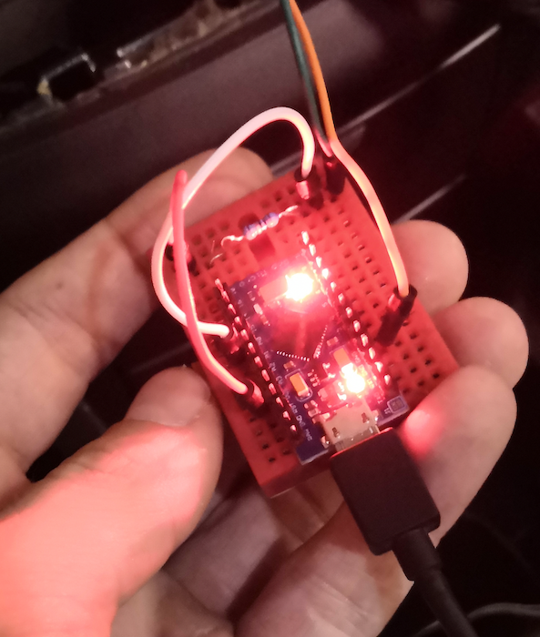

# steering-wheel-controls-arduino

> interface steering wheel controls with an arduino (stepped resistor)

> Inspired by https://www.youtube.com/watch?v=Caf-yBI9rHA&t=220s

<b>SWC Interface: Arduino Micro (with ATmega32U4 chip)</b>

The steering wheel controls with a stepped resistor. This required analog interpretation of multiple buttons over a single wire. If you have separate wires per button (probably not due to clock spring restrictions in a lot of steering wheels), then it is way easier, just hook up the gpio connectors through an optocoupler board.

Test the wiring with a multimeter, set it to measure resistance. hook up the meter so it completes a circuit with the SWC.
In sketch defined values are for specific car and resistance values, you should enter yours after measuring or add/remove if you have more/less controls introduced.

<b>Used [NicoHood/HID](https://github.com/NicoHood/HID) (instead of standard Keyboard) Consumer</b> for support of media keys for music player, browser, etc, which is compatible out-of-box with most devices I've tested it on (Android devices with OTG support, Macbook, Windows PC).
So you will need to install HID plugin to use this sketch properly.

<b>Example of wiring</b>, where orange one is GND and green one is analog input from car.

